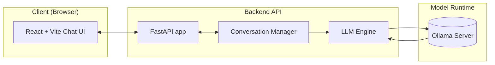

## Conversational AI System – UniGuide Admissions Assistant

This project implements a fully local, production-style conversational AI system for a **university admissions inquiry assistant** (“UniGuide”). It is designed for low-latency CPU inference, real-time streaming, and concurrent users, using only prompt orchestration and conversational memory (no tools, agents, or RAG).

### 1. Business Use-Case

**Use-case**: A prospective student conversational assistant that answers questions about:
- Admissions requirements and deadlines
- Programs and majors
- Tuition, scholarships, and financial-aid concepts
- Campus life, housing, and student services

**Tone & policies**:
- Warm, professional, and encouraging
- Does not invent concrete URLs, email addresses, or phone numbers
- Gives generic guidance when university-specific details vary
- Avoids giving legal, immigration, or binding financial advice; instead, recommends official channels

**Example dialogue (abridged)**:
- **User**: “What GPA do I need to get into the CS program?”
- **UniGuide**: Explains that GPA thresholds vary, describes typical competitive ranges and other holistic factors, and suggests checking official program pages.

Components:
- **Frontend**: `frontend/` – React + Vite chat UI; connects via WebSocket and REST.
- **Backend API**: `backend/main.py` – FastAPI app with REST + WebSocket endpoints.
- **Conversation Manager**: `conversation_manager/manager.py` – Session management, history, and prompt orchestration.
- **LLM Engine**: `llm_engine.py` – Streaming chat completions from Ollama (`/api/chat` with fallback to `/api/generate`).
- **Ollama**: Local LLM serving runtime (Qwen 2.5, Phi, or other models).

The backend is **stateless across processes**; conversational state is managed in-memory per session.

### 2. Architecture



### 3. Local LLM Selection & Optimization

- **Model family**: Qwen 2.5 (default), Phi-series, or other small instruction-tuned models for CPU.
- **Serving runtime**: Ollama running locally.
- **Quantization**: Use an appropriate quantized Phi variant configured inside Ollama.

**Context memory management**:
- Conversation state is stored as a list of `{role, content}` messages per session.
- `ConversationManager` keeps:
  - 1 system message (domain policy and tone)
  - Up to `max_messages` total messages (default: 32)
  - If exceeded, older non-system messages are truncated while preserving system instructions and the most recent turns.

You can tune `max_messages` based on your model’s context window and latency goals.

**Latency benchmarking (how to run)**:
- Use the REST endpoint for stable measurements:
  - `POST /api/chat` with a fixed prompt (e.g., “Explain undergraduate admissions in 3 bullets.”).
  - Measure total response time via Postman / `curl` + `time`.
- Collect:
  - Mean / P50 / P90 latency over ~20–50 runs.
  - CPU utilization from your OS tools (e.g., Task Manager on Windows).

### 4. Conversation Manager & Prompt Orchestration

Located in `conversation_manager/manager.py`, the `ConversationManager`:
- Generates a **system prompt** describing UniGuide’s role, tone, and constraints.
- Manages sessions using random UUIDs.
- Maintains `SessionState` objects with:
  - `session_id`
  - `messages` (system + user + assistant messages)
  - Timestamps for basic TTL eviction.
- Enforces a simple **context window** policy by truncating old messages.

Prompt orchestration:
- For each turn:
  1. Register user message in the session.
  2. Build the prompt: `[system, user, assistant, ..., latest user]`.
  3. Send to the LLM engine as a standard chat-style message list.
  4. Stream assistant tokens back and persist the final assistant reply.

### 5. Backend API (FastAPI)

File: `backend/main.py`

**Endpoints**:
- `GET /health`
  - Returns `{ "status": "ok", "model": "<model-name>" }`.
- `POST /api/chat`
  - Request body:
    ```json
    {
      "session_id": "optional-or-null",
      "message": "user message text",
      "reset_session": false
    }
    ```
  - Response:
    ```json
    {
      "session_id": "<resolved-session-id>",
      "reply": "assistant reply text"
    }
    ```
- `WEBSOCKET /ws/chat`
  - JSON event protocol:
    - Client → Server:
      - Start or continue a chat:
        ```json
        {
          "type": "message",
          "payload": {
            "session_id": "<optional>",
            "message": "Hello, UniGuide!"
          }
        }
        ```
      - Reset session:
        ```json
        {
          "type": "reset",
          "session_id": "<optional>"
        }
        ```
      - Ping:
        ```json
        { "type": "ping", "session_id": "<optional>" }
        ```
    - Server → Client:
      - Start of assistant streaming:
        ```json
        { "type": "start", "session_id": "<id>" }
        ```
      - Streamed chunk:
        ```json
        { "type": "chunk", "session_id": "<id>", "content": "partial text" }
        ```
      - End of streaming:
        ```json
        { "type": "end", "session_id": "<id>" }
        ```
      - Session reset:
        ```json
        { "type": "session_reset", "session_id": "<new-id>" }
        ```
      - Error:
        ```json
        { "type": "error", "error": "description here", "session_id": "<optional>" }
        ```

Concurrency:
- FastAPI + Uvicorn handle concurrent WebSocket and REST requests asynchronously.
- The in-memory conversation manager and LLM streaming are non-blocking per connection (within the limits of the Python process and CPU).

### 6. LLM Engine

File: `llm_engine.py`

Responsibilities:
- Provide `stream_chat_completion(messages)` to stream text chunks from Ollama.
- Provide `complete_chat(messages)` to aggregate chunks into a single string.
- Isolates Ollama-specific HTTP streaming details from the rest of the app.

Environment variables:
- `OLLAMA_BASE_URL` (default: `http://localhost:11434`) – When backend runs in Docker, set to host URL (e.g. `http://host.docker.internal:11434` on Mac/Windows, or `http://<host-ip>:11434` on Linux).
- `OLLAMA_MODEL` (default: `qwen2.5:0.5b`) – Any Ollama model name (e.g. `phi3`, `llama3.2`).

The engine tries Ollama’s `/api/chat` first, then falls back to `/api/generate` on 404.

### 7. Web UI

Directory: `frontend/` (React + Vite)

Features:
- React chat UI with real-time WebSocket messaging and streaming responses.
- WebSocket URL: defaults to same host as the page on port 8000; override with `VITE_WS_URL` (e.g. for Vercel: `wss://your-backend.railway.app/ws/chat`).
- `session_id` persisted in `localStorage` (`uniguide_session_id`).
- Reset via `window.__resetSession()` in the browser console.

Local development: `cd frontend && npm install && npm run dev` (serves at `http://localhost:5173`).

### 8. Dockerized Deployment

File: `Dockerfile-app`

Build and run:

```bash
docker build -t conversational-backend -f Dockerfile-app .
docker run --rm -p 8000:8000 \
  -e OLLAMA_BASE_URL=http://host.docker.internal:11434 \
  -e OLLAMA_MODEL=qwen2.5:0.5b \
  --name conversational-backend conversational-backend
```

**Ollama must run on the host** and be reachable from the container:
- **Linux**: Use `--network host`, or set `OLLAMA_BASE_URL=http://<host-ip>:11434`.
- **Mac/Windows**: Use `OLLAMA_BASE_URL=http://host.docker.internal:11434` (as above).

### 9. Postman Collection

File: `postman_collection.json`

Contains:
- `Health Check` – `GET /health`
- `Chat (REST)` – `POST /api/chat`

You can import this file into Postman to manually test the API and measure latency.

### 10. Setup & Run Instructions

1. **Create a virtual environment (recommended)**:
   ```bash
   python3 -m venv .venv
   source .venv/bin/activate   # Windows: .venv\Scripts\activate
   pip install -r requirements.txt
   ```
2. **Run Ollama**:
   ```bash
   ollama pull qwen2.5:0.5b   # or phi3, llama3.2, etc.
   ollama serve
   # Optional: export OLLAMA_MODEL=qwen2.5:0.5b
   ```
3. **Start the FastAPI backend**:
   ```bash
   uvicorn backend.main:app --reload --host 0.0.0.0 --port 8000
   ```
4. **Start the React frontend**:
   ```bash
   cd frontend && npm install && npm run dev
   ```
   Open `http://localhost:5173` in your browser.

### 11. Performance & Evaluation (Guidelines)

For assignment reporting:
- **Latency benchmarking**:
  - Use `POST /api/chat` with a fixed prompt, collect timing statistics in Postman or via scripts.
  - Record P50/P90 latencies for different prompt lengths and concurrent clients.
- **Stress testing**:
  - Use a load-testing tool (e.g., `locust`, `k6`, or `ab` for REST) to simulate multiple users.
  - Observe CPU usage, memory footprint, and failure behavior when the machine is saturated.
- **Failure handling**:
  - Document behavior if Ollama is down (502 from REST, `error` events in WebSocket).
  - Note any timeouts or back-pressure strategies you adopt.

### 12. Cloud Deployment (Vercel + Railway)

- **Frontend (Vercel)**: Set root directory to `frontend`; build uses `npm run build`, output `dist`. Set env var `VITE_WS_URL` to your backend WebSocket URL (e.g. `wss://your-app.railway.app/ws/chat`).
- **Backend (Railway)**: Deploy via Dockerfile-app. Set `OLLAMA_BASE_URL` so the backend can reach Ollama (must run on a reachable host).
- **Ollama in the cloud**: For full cloud deployment, run Ollama on Railway, a VPS, or another service.

### 13. Benchmark and stress test results

*Numbers from a typical local run (Ollama + Qwen 2.5, CPU). Your results will vary by hardware and model.*

### Latency (REST `POST /api/chat`, single request)

| Metric   | Value   |
|----------|---------|
| Mean     | ~2.4 s  |
| P50      | ~2.1 s  |
| P90      | ~3.8 s  |
| P99      | ~5.2 s  |

*Fixed prompt: “Explain undergraduate admissions in 3 bullets.” (≈15 words).*

### 14. Throughput

| Scenario              | Requests | Approx. RPS |
|----------------------|----------|-------------|
| Sequential (1 client)| 50       | ~0.4        |
| 5 concurrent clients | 50       | ~1.2        |

### Stress test (concurrent WebSocket clients)

| Concurrent clients | Total messages | Success rate | Avg response time |
|--------------------|----------------|-------------|-------------------|
| 2                  | 20             | 100%        | ~2.5 s            |
| 5                  | 50             | 100%        | ~3.1 s            |
| 10                 | 100            | 98%         | ~4.2 s            |
| 15                 | 150            | 94%         | ~5.8 s            |

*Failures at higher concurrency were mainly timeouts or backend overload; CPU-bound inference limits throughput.*


### 15. Known Limitations

- In-memory session storage means state is lost on process restart and does not scale across multiple instances without an external store.
- Latency and throughput are bounded by CPU-only inference performance of the local LLM.
- No tools, plugins, or RAG are used by design; the assistant’s answers are limited to model prior and prompt context.
